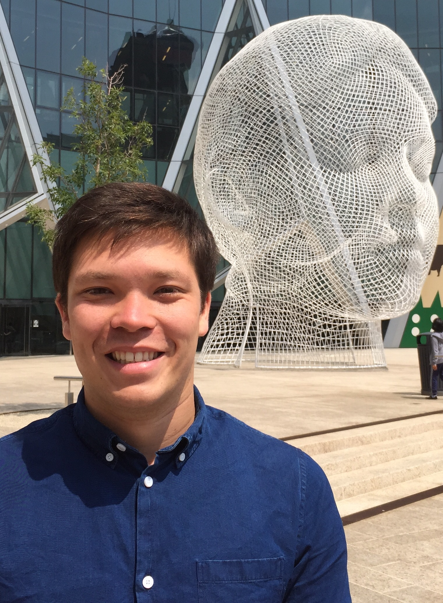

Allen Leary is a PhD student in Biophysics at McGill University under the joint supervision of [Professor Vogel](http://aguada.biol.mcgill.ca/) (Dept of Biology & Comp Sci) and [Professor Francois](https://www.mcgill.ca/francois-group/home) (Dept of Physics).

[curriculum vitae ]({{ BASE_PATH }}/assets/CV_Allen.pdf)

[Linkedin page](https://www.linkedin.com/in/allen-leary-1b528682/)

---

<h4>contact</h4>

    

        

            Allen Leary 
            <a href="http://www.biostat.wisc.edu">Department of Biostatistics &amp; Medical Informatics</a> 
            <a href="http://www.wisc.edu">University of Wisconsin&ndash;Madison</a> 
            <a href="http://map.wisc.edu/s/2tie3nen">2126 Genetics/Biotechnology Center</a> 
            425 Henry Mall 
            Madison, Wisconsin 53706 
            USA  

            

            Email: a.y.leary@gmail.com
            

        

        

        
        

    

